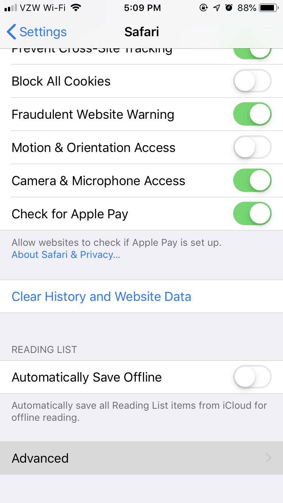
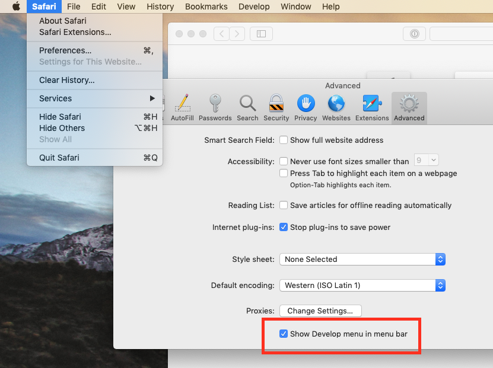
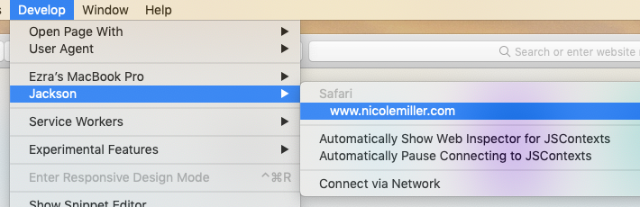
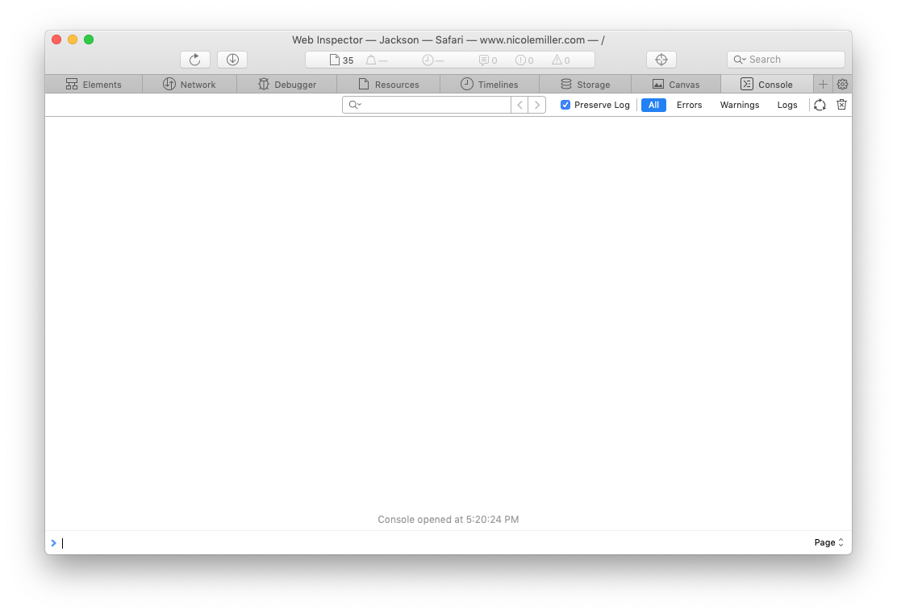

# Determining how to replicate

We need to know under exactly what conditions the issue occurs. To help figure this out, it's helpful to know of any specific browser errors. **You will need a MacOS device for these instructions.**

## Setup

### Set up your iPhone
On your phone, go to `Settings > Safari > Advanced` and check `Web Inspector`.

  
  
  
  
  

### Set up your Mac

Open Safari. Go to `Safari > Preferences > Advanced` and check `Show Develop menu in menu bar`.

### Connect your iPhone to your Mac

Plug in your iPhone via USB cable, and select **"Trust"** on your iPhone (if you're prompted). Open up the desired site on Safari for iPhone.

>  ⚠️ You **must** use Safari, not Chrome!

On your Mac, you should see your device under the `Develop` menu. Go to `Develop > [Device Name] > [Site Name]`, replacing `[Device Name]` for your iPhone's name and `[Site Name]` for the name of the site you have open on your iPhone.

You should see the following screen:

## Usage

Browse the site like normal. When the error occurs, **do not refresh the page!** 

- Take screenshots of the console window (pictured above) and your phone's screen
- Navigate to the `Network` tab (pictured below) and export its contents using the `Export` button at the upper right.

